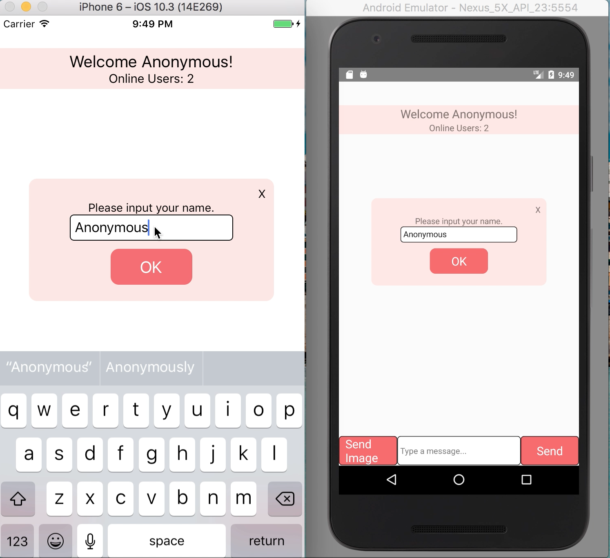

# Introduction
### This is an instant messaging tool in React Native. The features include the following:

- [x] Online/offline user status
- [x] Delivery reports (like WhatsApp)
- [x] Media sharing
- [x] Rich text/Emoji’s

# Demo
[Demo on youtube](https://www.youtube.com/watch?v=ugA1DqM4oIE&feature=youtu.be)

# Prerequisite

$ npm install -g react-native-cli

# How to set up ⬆️

Step 1: git clone this repo:

Step 2: cd to the cloned repo:

Step 3: npm install && react-native link

# How to Run ▶️

### for android
* Run emulator
* $ react-native run-android

### for iOS
* $ react-native run-ios

#### If the keyboard doesn't show up in iOS simulator, press ⌘ + K

#### If you want to run multiple iOS simulators to chat
Using MacOs Terminal, launch first simulator:

* Step 1: $ cd /Applications/Xcode.app/Contents/Developer/Applications
* Step 2: $ open -n Simulator.app
* Step 3: $ cd `<your react native project>`
* Step 4: $ react-native run-ios

Now, launch 2nd simulator:

* Step 5: $ cd /Applications/Xcode.app/Contents/Developer/Applications
* Step 6: $ open -n Simulator.app
* Step 7: Click "Ok" when you get "Unable to boot device in current state"
* Step 8: Change simulator to be different than first simulator (e.g. Hardware -> Device -> iPhone 6s)
* Step 9: $ cd `<your react-native project>`
* Step 10: $ react-native run-ios --simulator "iPhone 6s" (or whatever simulator you chose in step 8).

